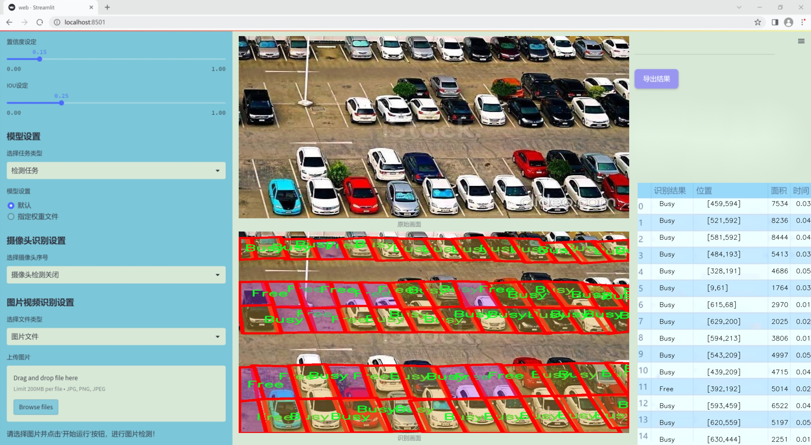
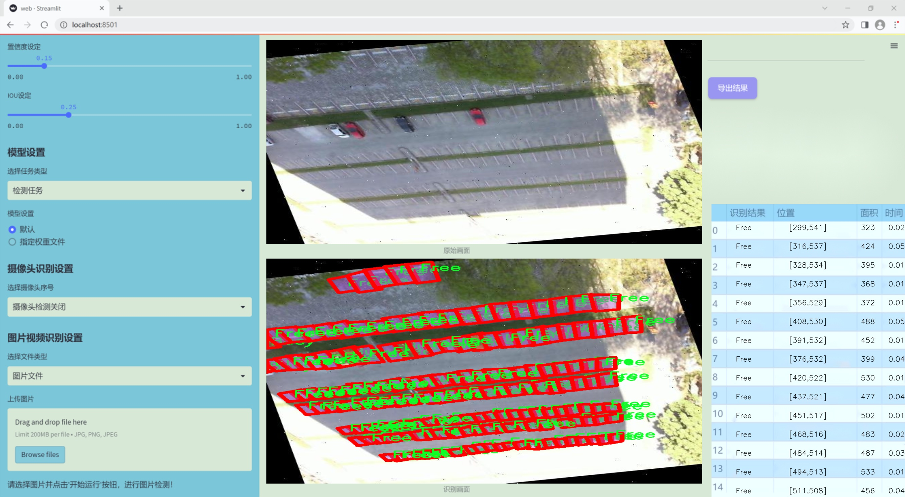
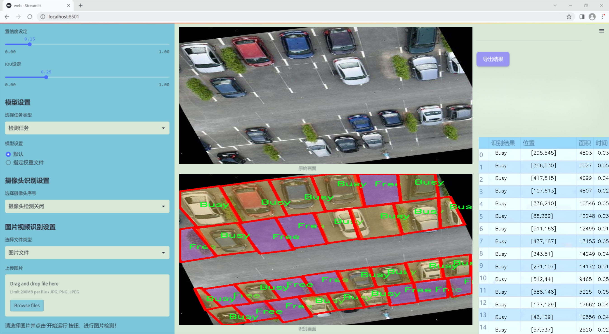
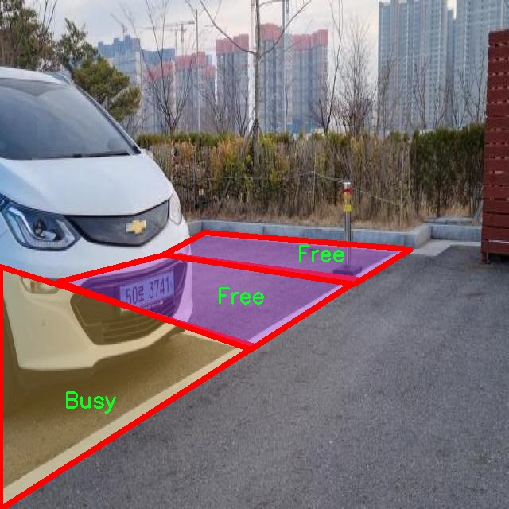
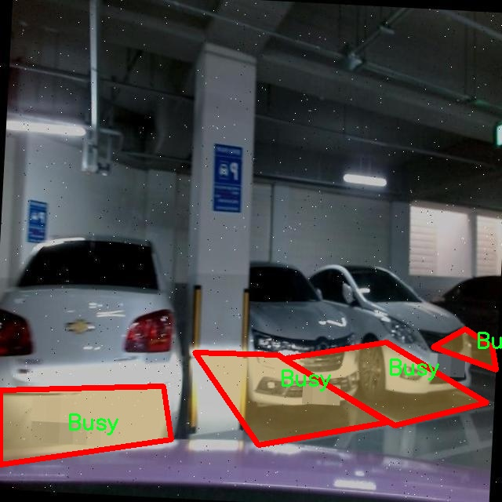
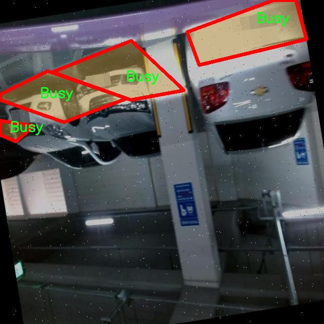
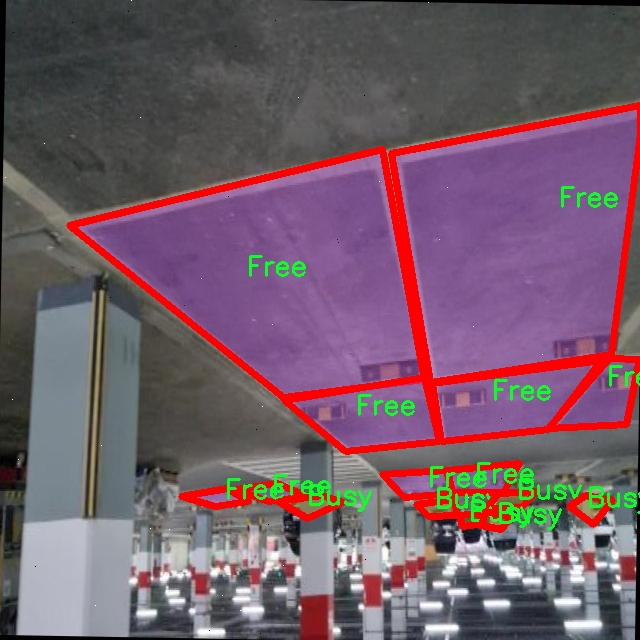
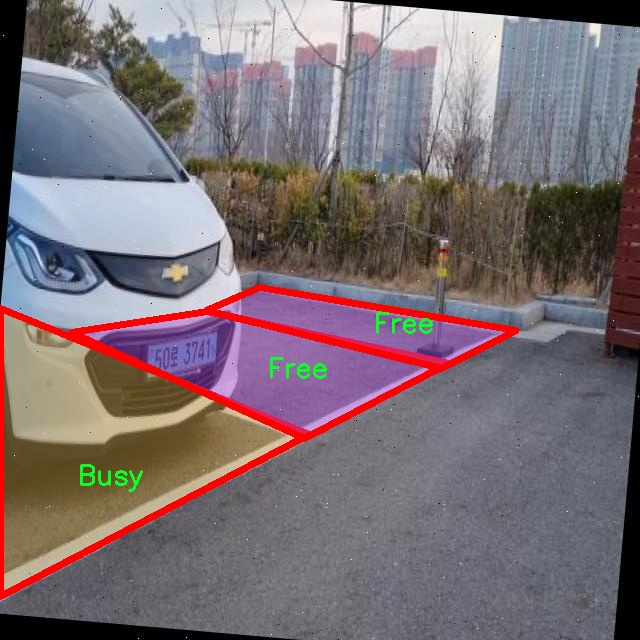

### 1.背景意义

### 研究背景与意义

随着城市化进程的加快，城市交通问题日益严重，停车难已成为许多城市面临的普遍挑战。有效的停车管理不仅能够提高城市交通的流动性，还能提升居民的生活质量。因此，开发一种高效的停车位状态检测系统显得尤为重要。基于深度学习的计算机视觉技术，尤其是目标检测算法的快速发展，为停车位状态的实时监测提供了新的解决方案。

本研究旨在基于改进的YOLOv11模型，构建一个高效的停车位状态检测系统。该系统能够实时识别停车位的状态，分类为“占用”（Busy）和“空闲”（Free），从而为驾驶员提供及时的停车信息，减少寻找停车位的时间，降低交通拥堵。通过使用包含3100张标注图像的数据集，系统能够在多种环境下进行训练和测试，确保其在实际应用中的鲁棒性和准确性。

停车位状态检测不仅对个人驾驶者有直接的益处，还能为城市交通管理提供数据支持。通过分析停车位的使用情况，城市管理者可以优化停车资源的配置，制定更合理的停车政策。此外，结合实时数据，智能交通系统可以为驾驶者提供更为精准的导航服务，提升整体交通效率。

综上所述，基于改进YOLOv11的停车位状态检测系统的研究具有重要的理论意义和实际应用价值。它不仅推动了计算机视觉技术在智能交通领域的应用，还为解决城市停车难题提供了创新的思路和方法。通过该系统的开发与应用，期待能够为未来的智慧城市建设贡献一份力量。

### 2.视频效果

[2.1 视频效果](https://www.bilibili.com/video/BV1qYkwY7EFF/)

### 3.图片效果







##### [项目涉及的源码数据来源链接](https://kdocs.cn/l/cszuIiCKVNis)**

注意：本项目提供训练的数据集和训练教程,由于版本持续更新,暂不提供权重文件（best.pt）,请按照6.训练教程进行训练后实现上图演示的效果。

### 4.数据集信息

##### 4.1 本项目数据集类别数＆类别名

nc: 2
names: ['Busy', 'Free']


该项目为【图像分割】数据集，请在【训练教程和Web端加载模型教程（第三步）】这一步的时候按照【图像分割】部分的教程来训练

##### 4.2 本项目数据集信息介绍

本项目数据集信息介绍

本项目旨在改进YOLOv11的停车位状态检测系统，因此所使用的数据集围绕“ParkingSlots”主题进行构建。该数据集专注于停车位的状态分类，包含两种主要类别：‘Busy’（占用）和‘Free’（空闲）。通过对这两种状态的精确识别，系统能够实时监测停车场的使用情况，从而为驾驶员提供有效的停车指导，提升停车效率，减少寻找停车位所需的时间。

数据集的构建过程涉及大量的图像采集与标注工作。为了确保数据的多样性和代表性，数据来源于不同类型的停车场，包括城市街道、商业区、住宅区等。每张图像均经过严格的标注，确保其准确反映停车位的真实状态。这一过程不仅提高了数据集的质量，也为后续的模型训练提供了坚实的基础。

在数据集的规模方面，涵盖了数千张图像，充分考虑了不同天气、光照条件及时间段的变化，确保模型在各种环境下均能保持良好的性能。此外，数据集还包含了不同角度和距离拍摄的停车位图像，以增强模型的泛化能力。这种多样化的训练数据将有助于YOLOv11在实际应用中更准确地识别停车位状态，从而有效降低误报率和漏报率。

通过使用这一数据集，研究团队期望能够提升停车位状态检测系统的准确性和可靠性，为智能交通系统的发展贡献力量。最终，改进后的系统将为城市交通管理提供有力支持，帮助解决停车难的问题，提升城市的整体交通效率。











### 5.全套项目环境部署视频教程（零基础手把手教学）

[5.1 所需软件PyCharm和Anaconda安装教程（第一步）](https://www.bilibili.com/video/BV1BoC1YCEKi/?spm_id_from=333.999.0.0&vd_source=bc9aec86d164b67a7004b996143742dc)


[5.2 安装Python虚拟环境创建和依赖库安装视频教程（第二步）](https://www.bilibili.com/video/BV1ZoC1YCEBw?spm_id_from=333.788.videopod.sections&vd_source=bc9aec86d164b67a7004b996143742dc)

### 6.改进YOLOv11训练教程和Web_UI前端加载模型教程（零基础手把手教学）

[6.1 改进YOLOv11训练教程和Web_UI前端加载模型教程（第三步）](https://www.bilibili.com/video/BV1BoC1YCEhR?spm_id_from=333.788.videopod.sections&vd_source=bc9aec86d164b67a7004b996143742dc)


按照上面的训练视频教程链接加载项目提供的数据集，运行train.py即可开始训练



     Epoch   gpu_mem       box       obj       cls    labels  img_size
     1/200     20.8G   0.01576   0.01955  0.007536        22      1280: 100%|██████████| 849/849 [14:42<00:00,  1.04s/it]
               Class     Images     Labels          P          R     mAP@.5 mAP@.5:.95: 100%|██████████| 213/213 [01:14<00:00,  2.87it/s]
                 all       3395      17314      0.994      0.957      0.0957      0.0843

     Epoch   gpu_mem       box       obj       cls    labels  img_size
     2/200     20.8G   0.01578   0.01923  0.007006        22      1280: 100%|██████████| 849/849 [14:44<00:00,  1.04s/it]
               Class     Images     Labels          P          R     mAP@.5 mAP@.5:.95: 100%|██████████| 213/213 [01:12<00:00,  2.95it/s]
                 all       3395      17314      0.996      0.956      0.0957      0.0845

     Epoch   gpu_mem       box       obj       cls    labels  img_size
     3/200     20.8G   0.01561    0.0191  0.006895        27      1280: 100%|██████████| 849/849 [10:56<00:00,  1.29it/s]
               Class     Images     Labels          P          R     mAP@.5 mAP@.5:.95: 100%|███████   | 187/213 [00:52<00:00,  4.04it/s]
                 all       3395      17314      0.996      0.957      0.0957      0.0845


###### [项目数据集下载链接](https://kdocs.cn/l/cszuIiCKVNis)

### 7.原始YOLOv11算法讲解


###### YOLOv11改进方向

与YOLOv 10相比，YOLOv 11有了巨大的改进，包括但不限于：

  * 增强的模型结构：模型具有改进的模型结构，以获取图像处理并形成预测
  * GPU优化：这是现代ML模型的反映，GPU训练ML模型在速度和准确性上都更好。
  * 速度：YOLOv 11模型现在经过增强和GPU优化以用于训练。通过优化，这些模型比它们的前版本快得多。在速度上达到了25%的延迟减少！
  * 更少的参数：更少的参数允许更快的模型，但v11的准确性不受影响
  * 更具适应性：更多支持的任务YOLOv 11支持多种类型的任务、多种类型的对象和多种类型的图像。

###### YOLOv11功能介绍

Glenn Jocher和他的团队制作了一个令人敬畏的YOLOv 11迭代，并且在图像人工智能的各个方面都提供了YOLO。YOLOv 11有多种型号，包括：

  * 对象检测-在训练时检测图像中的对象
  * 图像分割-超越对象检测，分割出图像中的对象
  * 姿态检测-当用点和线训练时绘制一个人的姿势
  * 定向检测（OBB）：类似于对象检测，但包围盒可以旋转
  * 图像分类-在训练时对图像进行分类

使用Ultralytics Library，这些模型还可以进行优化，以：

  * 跟踪-可以跟踪对象的路径
  * 易于导出-库可以以不同的格式和目的导出
  * 多场景-您可以针对不同的对象和图像训练模型

此外，Ultralytics还推出了YOLOv 11的企业模型，该模型将于10月31日发布。这将与开源的YOLOv
11模型并行，但将拥有更大的专有Ultralytics数据集。YOLOv 11是“建立在过去的成功”的其他版本的之上。

###### YOLOv11模型介绍

YOLOv 11附带了边界框模型（无后缀），实例分割（-seg），姿态估计（-pose），定向边界框（-obb）和分类（-cls）。

这些也有不同的尺寸：纳米（n），小（s），中（m），大（l），超大（x）。


YOLOv11模型

###### YOLOv11与前版本对比

与YOLOv10和YOLOv8相比，YOLOv11在Ultralytics的任何帖子中都没有直接提到。所以我会收集所有的数据来比较它们。感谢Ultralytics：

**检测：**


YOLOv11检测统计


YOLOv10检测统计

其中，Nano的mAPval在v11上为39.5，v10上为38.5；Small为47.0 vs 46.3，Medium为51.5 vs
51.1，Large为53.4 vs 53.2，Extra Large为54.7vs
54.4。现在，这可能看起来像是一种增量增加，但小小数的增加可能会对ML模型产生很大影响。总体而言，YOLOv11以0.3
mAPval的优势追平或击败YOLOv10。

现在，我们必须看看速度。在延迟方面，Nano在v11上为1.55 , v10上为1.84，Small为2.46 v2.49，Medium为4.70
v4.74，Large为6.16 v7.28，Extra Large为11.31
v10.70。延迟越低越好。YOLOv11提供了一个非常低的延迟相比，除了特大做得相当差的前身。

总的来说，Nano模型是令人振奋的，速度更快，性能相当。Extra Large在性能上有很好的提升，但它的延迟非常糟糕。

**分割：**


YOLOV11 分割统计


YOLOV9 分割统计


YOLOV8 分割数据

总体而言，YOLOv 11上的分割模型在大型和超大型模型方面比上一代YOLOv 8和YOLOv 9做得更好。

YOLOv 9 Segmentation没有提供任何关于延迟的统计数据。比较YOLOv 11延迟和YOLOv 8延迟，发现YOLOv 11比YOLOv
8快得多。YOLOv 11将大量GPU集成到他们的模型中，因此期望他们的模型甚至比CPU测试的基准更快！

姿态估计：


YOLOV11姿态估计统计


YOLOV8姿态估计统计

YOLOv 11的mAP 50 -95统计量也逐渐优于先前的YOLOv 8（除大型外）。然而，在速度方面，YOLOv
11姿势可以最大限度地减少延迟。其中一些延迟指标是版本的1/4！通过对这些模型进行GPU训练优化，我可以看到指标比显示的要好得多。

**定向边界框：**


YOLOv11 OBB统计


YOLOv8 OBB统计

OBB统计数据在mAP
50上并不是很好，只有非常小的改进，在某种程度上小于检测中的微小改进。然而，从v8到v11的速度减半，这表明YOLOv11在速度上做了很多努力。

**最后，分类：**


YOLOv 11 CLS统计


YOLOv8 CLS统计

从v8到v11，准确性也有了微小的提高。然而，速度大幅上升，CPU速度更快的型号。


### 8.200+种全套改进YOLOV11创新点原理讲解

#### 8.1 200+种全套改进YOLOV11创新点原理讲解大全

由于篇幅限制，每个创新点的具体原理讲解就不全部展开，具体见下列网址中的改进模块对应项目的技术原理博客网址【Blog】（创新点均为模块化搭建，原理适配YOLOv5~YOLOv11等各种版本）

[改进模块技术原理博客【Blog】网址链接](https://gitee.com/qunmasj/good)


#### 8.2 精选部分改进YOLOV11创新点原理讲解

###### 这里节选部分改进创新点展开原理讲解(完整的改进原理见上图和[改进模块技术原理博客链接](https://gitee.com/qunmasj/good)【如果此小节的图加载失败可以通过CSDN或者Github搜索该博客的标题访问原始博客，原始博客图片显示正常】

### 动态蛇形卷积Dynamic Snake Convolution

参考论文： 2307.08388.pdf (arxiv.org)

血管、道路等拓扑管状结构的精确分割在各个领域都至关重要，确保下游任务的准确性和效率。 然而，许多因素使任务变得复杂，包括薄的局部结构和可变的全局形态。在这项工作中，我们注意到管状结构的特殊性，并利用这些知识来指导我们的 DSCNet 在三个阶段同时增强感知：特征提取、特征融合、 和损失约束。 首先，我们提出了一种动态蛇卷积，通过自适应地关注细长和曲折的局部结构来准确捕获管状结构的特征。 随后，我们提出了一种多视图特征融合策略，以补充特征融合过程中多角度对特征的关注，确保保留来自不同全局形态的重要信息。 最后，提出了一种基于持久同源性的连续性约束损失函数，以更好地约束分割的拓扑连续性。 2D 和 3D 数据集上的实验表明，与多种方法相比，我们的 DSCNet 在管状结构分割任务上提供了更好的准确性和连续性。 我们的代码是公开的。 
主要的挑战源于细长微弱的局部结构特征与复杂多变的全局形态特征。本文关注到管状结构细长连续的特点，并利用这一信息在神经网络以下三个阶段同时增强感知：特征提取、特征融合和损失约束。分别设计了动态蛇形卷积（Dynamic Snake Convolution），多视角特征融合策略与连续性拓扑约束损失。 

我们希望卷积核一方面能够自由地贴合结构学习特征，另一方面能够在约束条件下不偏离目标结构太远。在观察管状结构的细长连续的特征后，脑海里想到了一个动物——蛇。我们希望卷积核能够像蛇一样动态地扭动，来贴合目标的结构。

我们希望卷积核一方面能够自由地贴合结构学习特征，另一方面能够在约束条件下不偏离目标结构太远。在观察管状结构的细长连续的特征后，脑海里想到了一个动物——蛇。我们希望卷积核能够像蛇一样动态地扭动，来贴合目标的结构。


### DCNV2融入YOLOv11
DCN和DCNv2（可变性卷积）
网上关于两篇文章的详细描述已经很多了，我这里具体的细节就不多讲了，只说一下其中实现起来比较困惑的点。（黑体字会讲解）

DCNv1解决的问题就是我们常规的图像增强，仿射变换（线性变换加平移）不能解决的多种形式目标变换的几何变换的问题。如下图所示。

可变性卷积的思想很简单，就是讲原来固定形状的卷积核变成可变的。如下图所示：


首先来看普通卷积，以3x3卷积为例对于每个输出y(p0)，都要从x上采样9个位置，这9个位置都在中心位置x(p0)向四周扩散得到的gird形状上，(-1,-1)代表x(p0)的左上角，(1,1)代表x(p0)的右下角，其他类似。

用公式表示如下：


可变性卷积Deformable Conv操作并没有改变卷积的计算操作，而是在卷积操作的作用区域上，加入了一个可学习的参数∆pn。同样对于每个输出y(p0)，都要从x上采样9个位置，这9个位置是中心位置x(p0)向四周扩散得到的，但是多了 ∆pn，允许采样点扩散成非gird形状。


偏移量是通过对原始特征层进行卷积得到的。比如输入特征层是w×h×c，先对输入的特征层进行卷积操作，得到w×h×2c的offset field。这里的w和h和原始特征层的w和h是一致的，offset field里面的值是输入特征层对应位置的偏移量，偏移量有x和y两个方向，所以offset field的channel数是2c。offset field里的偏移量是卷积得到的，可能是浮点数，所以接下来需要通过双向性插值计算偏移位置的特征值。在偏移量的学习中，梯度是通过双线性插值来进行反向传播的。
看到这里是不是还是有点迷茫呢？那到底程序上面怎么实现呢？


事实上由上面的公式我们可以看得出来∆pn这个偏移量是加在原像素点上的，但是我们怎么样从代码上对原像素点加这个量呢？其实很简单，就是用一个普通的卷积核去跟输入图片（一般是输入的feature_map）卷积就可以了卷积核的数量是2N也就是23*3==18（前9个通道是x方向的偏移量，后9个是y方向的偏移量），然后把这个卷积的结果与正常卷积的结果进行相加就可以了。
然后又有了第二个问题，怎么样反向传播呢？为什么会有这个问题呢？因为求出来的偏移量+正常卷积输出的结果往往是一个浮点数，浮点数是无法对应到原图的像素点的，所以自然就想到了双线性差值的方法求出浮点数对应的浮点像素点。


#### DCN v2
对于positive的样本来说，采样的特征应该focus在RoI内，如果特征中包含了过多超出RoI的内容，那么结果会受到影响和干扰。而negative样本则恰恰相反，引入一些超出RoI的特征有助于帮助网络判别这个区域是背景区域。

DCNv1引入了可变形卷积，能更好的适应目标的几何变换。但是v1可视化结果显示其感受野对应位置超出了目标范围，导致特征不受图像内容影响（理想情况是所有的对应位置分布在目标范围以内）。

为了解决该问题：提出v2, 主要有

1、扩展可变形卷积，增强建模能力
2、提出了特征模拟方案指导网络培训：feature mimicking scheme

上面这段话是什么意思呢，通俗来讲就是，我们的可变性卷积的区域大于目标所在区域，所以这时候就会对非目标区域进行错误识别。

所以自然能想到的解决方案就是加入权重项进行惩罚。（至于这个实现起来就比较简单了，直接初始化一个权重然后乘(input+offsets)就可以了）


可调节的RoIpooling也是类似的，公式如下：


### 9.系统功能展示

图9.1.系统支持检测结果表格显示

  图9.2.系统支持置信度和IOU阈值手动调节

  图9.3.系统支持自定义加载权重文件best.pt(需要你通过步骤5中训练获得)

  图9.4.系统支持摄像头实时识别

  图9.5.系统支持图片识别

  图9.6.系统支持视频识别

  图9.7.系统支持识别结果文件自动保存

  图9.8.系统支持Excel导出检测结果数据


### 10. YOLOv11核心改进源码讲解

#### 10.1 VanillaNet.py

以下是对代码的核心部分进行提炼和详细注释的结果：

```python
import torch
import torch.nn as nn
import torch.nn.functional as F
from timm.layers import weight_init

# 定义激活函数类，继承自 ReLU
class Activation(nn.ReLU):
    def __init__(self, dim, act_num=3, deploy=False):
        super(Activation, self).__init__()
        self.deploy = deploy  # 是否为部署模式
        # 权重参数初始化
        self.weight = torch.nn.Parameter(torch.randn(dim, 1, act_num * 2 + 1, act_num * 2 + 1))
        self.bias = None
        self.bn = nn.BatchNorm2d(dim, eps=1e-6)  # 批归一化
        self.dim = dim
        self.act_num = act_num
        weight_init.trunc_normal_(self.weight, std=.02)  # 权重初始化

    def forward(self, x):
        # 前向传播
        if self.deploy:
            # 部署模式下的卷积操作
            return F.conv2d(
                super(Activation, self).forward(x), 
                self.weight, self.bias, padding=(self.act_num * 2 + 1) // 2, groups=self.dim)
        else:
            # 训练模式下的卷积操作
            return self.bn(F.conv2d(
                super(Activation, self).forward(x),
                self.weight, padding=self.act_num, groups=self.dim))

    def switch_to_deploy(self):
        # 切换到部署模式
        if not self.deploy:
            kernel, bias = self._fuse_bn_tensor(self.weight, self.bn)  # 融合BN层
            self.weight.data = kernel
            self.bias = torch.nn.Parameter(torch.zeros(self.dim))
            self.bias.data = bias
            self.__delattr__('bn')  # 删除bn属性
            self.deploy = True

    def _fuse_bn_tensor(self, weight, bn):
        # 融合卷积层和BN层的权重
        kernel = weight
        running_mean = bn.running_mean
        running_var = bn.running_var
        gamma = bn.weight
        beta = bn.bias
        eps = bn.eps
        std = (running_var + eps).sqrt()
        t = (gamma / std).reshape(-1, 1, 1, 1)
        return kernel * t, beta + (0 - running_mean) * gamma / std

# 定义网络块
class Block(nn.Module):
    def __init__(self, dim, dim_out, act_num=3, stride=2, deploy=False):
        super().__init__()
        self.deploy = deploy
        # 根据是否为部署模式选择不同的卷积结构
        if self.deploy:
            self.conv = nn.Conv2d(dim, dim_out, kernel_size=1)
        else:
            self.conv1 = nn.Sequential(
                nn.Conv2d(dim, dim, kernel_size=1),
                nn.BatchNorm2d(dim, eps=1e-6),
            )
            self.conv2 = nn.Sequential(
                nn.Conv2d(dim, dim_out, kernel_size=1),
                nn.BatchNorm2d(dim_out, eps=1e-6)
            )
        # 池化层
        self.pool = nn.MaxPool2d(stride) if stride != 1 else nn.Identity()
        self.act = Activation(dim_out, act_num)  # 激活函数

    def forward(self, x):
        # 前向传播
        if self.deploy:
            x = self.conv(x)
        else:
            x = self.conv1(x)
            x = F.leaky_relu(x, negative_slope=1)  # 使用Leaky ReLU激活
            x = self.conv2(x)

        x = self.pool(x)  # 池化
        x = self.act(x)  # 激活
        return x

    def switch_to_deploy(self):
        # 切换到部署模式
        if not self.deploy:
            # 融合卷积和BN层
            kernel, bias = self._fuse_bn_tensor(self.conv1[0], self.conv1[1])
            self.conv1[0].weight.data = kernel
            self.conv1[0].bias.data = bias
            kernel, bias = self._fuse_bn_tensor(self.conv2[0], self.conv2[1])
            self.conv = self.conv2[0]  # 更新卷积层
            self.conv.weight.data = kernel
            self.conv.bias.data = bias
            self.__delattr__('conv1')
            self.__delattr__('conv2')
            self.act.switch_to_deploy()  # 切换激活函数
            self.deploy = True

# 定义主网络结构
class VanillaNet(nn.Module):
    def __init__(self, in_chans=3, num_classes=1000, dims=[96, 192, 384, 768], 
                 drop_rate=0, act_num=3, strides=[2, 2, 2, 1], deploy=False):
        super().__init__()
        self.deploy = deploy
        # 网络的stem部分
        if self.deploy:
            self.stem = nn.Sequential(
                nn.Conv2d(in_chans, dims[0], kernel_size=4, stride=4),
                Activation(dims[0], act_num)
            )
        else:
            self.stem1 = nn.Sequential(
                nn.Conv2d(in_chans, dims[0], kernel_size=4, stride=4),
                nn.BatchNorm2d(dims[0], eps=1e-6),
            )
            self.stem2 = nn.Sequential(
                nn.Conv2d(dims[0], dims[0], kernel_size=1, stride=1),
                nn.BatchNorm2d(dims[0], eps=1e-6),
                Activation(dims[0], act_num)
            )

        self.stages = nn.ModuleList()
        for i in range(len(strides)):
            stage = Block(dim=dims[i], dim_out=dims[i + 1], act_num=act_num, stride=strides[i], deploy=deploy)
            self.stages.append(stage)  # 添加网络块

    def forward(self, x):
        # 前向传播
        if self.deploy:
            x = self.stem(x)
        else:
            x = self.stem1(x)
            x = F.leaky_relu(x, negative_slope=1)
            x = self.stem2(x)

        for stage in self.stages:
            x = stage(x)  # 依次通过每个网络块
        return x

    def switch_to_deploy(self):
        # 切换到部署模式
        if not self.deploy:
            self.stem2[2].switch_to_deploy()
            kernel, bias = self._fuse_bn_tensor(self.stem1[0], self.stem1[1])
            self.stem1[0].weight.data = kernel
            self.stem1[0].bias.data = bias
            self.stem = nn.Sequential(self.stem1[0], self.stem2[2])
            self.__delattr__('stem1')
            self.__delattr__('stem2')

            for stage in self.stages:
                stage.switch_to_deploy()  # 切换每个网络块
            self.deploy = True

# 用于加载预训练权重的函数
def update_weight(model_dict, weight_dict):
    temp_dict = {}
    for k, v in weight_dict.items():
        if k in model_dict.keys() and model_dict[k].shape == v.shape:
            temp_dict[k] = v
    model_dict.update(temp_dict)
    return model_dict

# 创建不同版本的VanillaNet模型
def vanillanet_5(pretrained='', **kwargs):
    model = VanillaNet(dims=[128 * 4, 256 * 4, 512 * 4, 1024 * 4], strides=[2, 2, 2], **kwargs)
    if pretrained:
        weights = torch.load(pretrained)['model_ema']
        model.load_state_dict(update_weight(model.state_dict(), weights))
    return model

# 其他版本的创建函数类似...
```

### 代码分析
1. **Activation 类**: 这个类实现了一个自定义的激活函数，支持训练和部署模式。它包含了权重和偏置的初始化，并提供了前向传播的实现。

2. **Block 类**: 这个类定义了网络的基本构建块，包含了卷积层、批归一化层和激活函数。根据输入的步幅决定是否使用池化层。

3. **VanillaNet 类**: 这是主网络结构，包含了stem部分和多个Block。它支持不同的输入通道数和输出类别数，并可以通过传入的参数配置网络的深度和宽度。

4. **update_weight 函数**: 这个函数用于更新模型的权重，确保加载的权重与模型的结构匹配。

5. **模型创建函数**: 这些函数根据不同的配置创建 VanillaNet 模型，并支持加载预训练权重。

以上是对代码的核心部分和详细注释，希望能帮助理解代码的结构和功能。

该文件 `VanillaNet.py` 实现了一个名为 VanillaNet 的深度学习模型，主要用于图像处理任务。该模型的设计灵感来源于卷积神经网络（CNN），并且提供了多种不同配置的网络结构。以下是对文件中主要内容的逐步分析和说明。

首先，文件开头包含版权信息和许可声明，表明该程序是开源的，可以在 MIT 许可下进行修改和分发。接着，导入了必要的库，包括 PyTorch 和一些辅助函数。

接下来，定义了一个名为 `activation` 的类，该类继承自 `nn.ReLU`，用于实现自定义的激活函数。这个类中包含了一个可学习的权重和偏置，利用卷积操作对输入进行处理，并在前向传播中应用批归一化（Batch Normalization）。该类还提供了一个方法 `switch_to_deploy`，用于在推理阶段将模型切换到部署模式，合并卷积层和批归一化层的参数。

然后，定义了一个 `Block` 类，表示网络中的基本构建块。该类包含多个卷积层和激活函数，并根据步幅选择不同的池化策略。与 `activation` 类类似，`Block` 类也实现了 `switch_to_deploy` 方法，用于在推理阶段优化模型结构。

接下来，`VanillaNet` 类是整个模型的核心。它接受输入通道数、类别数、各层的维度、丢弃率、激活函数数量、步幅等参数进行初始化。该类构建了一个由多个 `Block` 组成的网络结构，并在前向传播中处理输入数据。`VanillaNet` 还提供了一个 `_init_weights` 方法，用于初始化网络权重。

此外，文件中还定义了一些辅助函数，如 `update_weight`，用于更新模型的权重；以及多个函数（如 `vanillanet_5`、`vanillanet_6` 等），用于创建不同配置的 VanillaNet 模型，并可选择加载预训练权重。

最后，在文件的主程序部分，创建了一个输入张量并实例化了一个 VanillaNet 模型，随后进行前向传播并打印输出特征图的尺寸。

整体而言，该文件实现了一个灵活且可扩展的卷积神经网络架构，适用于多种图像处理任务，并提供了多种配置选项以满足不同需求。

#### 10.2 SMPConv.py

以下是代码中最核心的部分，并附上详细的中文注释：

```python
import torch
import torch.nn as nn
import torch.nn.functional as F

# 定义相对位置的函数
def rel_pos(kernel_size):
    # 创建一个从-1到1的线性空间，生成两个维度的坐标
    tensors = [torch.linspace(-1, 1, steps=kernel_size) for _ in range(2)]
    # 生成网格坐标
    kernel_coord = torch.stack(torch.meshgrid(*tensors), dim=-0)
    kernel_coord = kernel_coord.unsqueeze(0)  # 增加一个维度
    return kernel_coord

# 定义自定义卷积层
class SMPConv(nn.Module):
    def __init__(self, planes, kernel_size, n_points, stride, padding, groups):
        super().__init__()

        self.planes = planes  # 输出通道数
        self.kernel_size = kernel_size  # 卷积核大小
        self.n_points = n_points  # 关键点数量
        self.init_radius = 2 * (2/kernel_size)  # 初始化半径

        # 生成卷积核坐标
        kernel_coord = rel_pos(kernel_size)
        self.register_buffer('kernel_coord', kernel_coord)  # 注册为缓冲区，不会被优化

        # 权重坐标初始化
        weight_coord = torch.empty(1, n_points, 2)
        nn.init.trunc_normal_(weight_coord, std=0.2, a=-1., b=1.)  # 使用截断正态分布初始化
        self.weight_coord = nn.Parameter(weight_coord)  # 注册为可学习参数

        # 半径初始化
        self.radius = nn.Parameter(torch.empty(1, n_points).unsqueeze(-1).unsqueeze(-1))
        self.radius.data.fill_(value=self.init_radius)  # 填充初始值

        # 权重初始化
        weights = torch.empty(1, planes, n_points)
        nn.init.trunc_normal_(weights, std=.02)  # 使用截断正态分布初始化
        self.weights = nn.Parameter(weights)  # 注册为可学习参数

    def forward(self, x):
        # 生成卷积核并进行前向传播
        kernels = self.make_kernels().unsqueeze(1)  # 生成卷积核
        x = x.contiguous()  # 确保输入是连续的
        kernels = kernels.contiguous()  # 确保卷积核是连续的

        # 根据输入数据类型选择相应的卷积实现
        if x.dtype == torch.float32:
            x = _DepthWiseConv2dImplicitGEMMFP32.apply(x, kernels)  # FP32卷积
        elif x.dtype == torch.float16:
            x = _DepthWiseConv2dImplicitGEMMFP16.apply(x, kernels)  # FP16卷积
        else:
            raise TypeError("Only support fp32 and fp16, get {}".format(x.dtype))  # 抛出异常
        return x        

    def make_kernels(self):
        # 计算卷积核
        diff = self.weight_coord.unsqueeze(-2) - self.kernel_coord.reshape(1, 2, -1).transpose(1, 2)  # 计算差值
        diff = diff.transpose(2, 3).reshape(1, self.n_points, 2, self.kernel_size, self.kernel_size)  # 重塑形状
        diff = F.relu(1 - torch.sum(torch.abs(diff), dim=2) / self.radius)  # 计算ReLU激活

        # 计算最终的卷积核
        kernels = torch.matmul(self.weights, diff.reshape(1, self.n_points, -1))  # 矩阵乘法
        kernels = kernels.reshape(1, self.planes, *self.kernel_coord.shape[2:])  # 重塑形状
        kernels = kernels.squeeze(0)  # 去掉多余的维度
        kernels = torch.flip(kernels.permute(0, 2, 1), dims=(1,))  # 反转维度
        return kernels

# 定义SMPBlock模块
class SMPBlock(nn.Module):
    def __init__(self, in_channels, dw_channels, lk_size, drop_path, n_points=None, n_points_divide=4):
        super().__init__()
        self.pw1 = conv_bn_relu(in_channels, dw_channels, 1, 1, 0, groups=1)  # 逐点卷积
        self.pw2 = conv_bn(dw_channels, in_channels, 1, 1, 0, groups=1)  # 逐点卷积
        self.large_kernel = SMPCNN(in_channels=dw_channels, out_channels=dw_channels, kernel_size=lk_size,
                                   stride=1, groups=dw_channels, n_points=n_points, n_points_divide=n_points_divide)  # 大卷积核
        self.lk_nonlinear = nn.ReLU()  # 非线性激活
        self.drop_path = DropPath(drop_path) if drop_path > 0. else nn.Identity()  # DropPath层

    def forward(self, x):
        out = self.pw1(x)  # 逐点卷积
        out = self.large_kernel(out)  # 大卷积核
        out = self.lk_nonlinear(out)  # 激活
        out = self.pw2(out)  # 逐点卷积
        return x + self.drop_path(out)  # 残差连接
```

### 代码说明：
1. **SMPConv类**：实现了一种自定义的卷积层，支持动态生成卷积核，利用权重坐标和卷积核坐标的差值来计算卷积核，并根据输入数据类型选择不同的卷积实现。
2. **SMPBlock类**：结合逐点卷积和大卷积核的特性，通过残差连接来增强特征传递，使用DropPath来实现随机丢弃路径的效果，有助于模型的正则化。

这个程序文件 `SMPConv.py` 定义了一些用于构建深度学习模型的类和函数，主要集中在卷积操作和模块的实现上。文件中使用了 PyTorch 框架，并引入了一些额外的模块来实现特定的功能。

首先，文件导入了必要的 PyTorch 模块，包括神经网络模块（`torch.nn`）、功能模块（`torch.nn.functional`）以及检查点工具（`torch.utils.checkpoint`）。同时，还尝试导入了一些自定义的深度可分离卷积实现，分别用于 FP16 和 FP32 精度的计算。

文件中定义了一个 `rel_pos` 函数，用于生成相对位置的坐标，这对于后续的卷积核生成是必要的。

接下来，定义了 `SMPConv` 类，这是一个自定义的卷积层。它的构造函数接收多个参数，包括输出通道数、卷积核大小、采样点数、步幅、填充和分组数。在初始化过程中，计算并注册了卷积核的坐标，并随机初始化了权重坐标和半径。`forward` 方法中实现了卷积操作，支持 FP32 和 FP16 的输入数据类型。

`make_kernels` 方法用于生成卷积核，通过计算权重坐标与卷积核坐标之间的差异，并利用这些差异生成最终的卷积核。`radius_clip` 方法则用于限制半径的范围，确保其在指定的最小值和最大值之间。

`get_conv2d` 函数用于根据输入参数返回适当的卷积层，支持自定义的 `SMPConv` 或标准的 `nn.Conv2d`。此外，文件中还定义了一些用于批归一化的函数，包括 `get_bn` 和 `conv_bn`，这些函数根据全局变量 `use_sync_bn` 决定使用同步批归一化还是普通批归一化。

`SMPCNN` 类是一个包含多个卷积层的网络模块，它结合了自定义的 `SMPConv` 和标准卷积层。`SMPCNN_ConvFFN` 类则实现了一个前馈网络模块，包含两个逐点卷积层和一个非线性激活函数。

最后，`SMPBlock` 类实现了一个包含多个卷积操作的复合模块，结合了逐点卷积和自定义的 `SMPCNN`，并使用残差连接和丢弃路径（Drop Path）机制。

整体来看，这个文件提供了一种灵活的方式来构建复杂的卷积神经网络，尤其适用于需要自定义卷积操作和高效计算的场景。

#### 10.3 afpn.py

以下是代码中最核心的部分，并附上详细的中文注释：

```python
import torch
import torch.nn as nn
import torch.nn.functional as F
from ..modules.conv import Conv

# 定义基本的卷积块
class BasicBlock(nn.Module):
    def __init__(self, filter_in, filter_out):
        super(BasicBlock, self).__init__()
        # 定义两个卷积层
        self.conv1 = Conv(filter_in, filter_out, 3)  # 第一个卷积层，卷积核大小为3
        self.conv2 = Conv(filter_out, filter_out, 3, act=False)  # 第二个卷积层，卷积核大小为3，不使用激活函数

    def forward(self, x):
        residual = x  # 保存输入作为残差
        out = self.conv1(x)  # 通过第一个卷积层
        out = self.conv2(out)  # 通过第二个卷积层
        out += residual  # 添加残差
        return self.conv1.act(out)  # 返回经过激活函数处理的输出


# 定义上采样模块
class Upsample(nn.Module):
    def __init__(self, in_channels, out_channels, scale_factor=2):
        super(Upsample, self).__init__()
        # 定义上采样操作，使用1x1卷积层后接双线性插值上采样
        self.upsample = nn.Sequential(
            Conv(in_channels, out_channels, 1),  # 1x1卷积
            nn.Upsample(scale_factor=scale_factor, mode='bilinear')  # 双线性插值上采样
        )

    def forward(self, x):
        return self.upsample(x)  # 前向传播


# 定义自适应特征融合模块（ASFF）
class ASFF_2(nn.Module):
    def __init__(self, inter_dim=512):
        super(ASFF_2, self).__init__()
        self.inter_dim = inter_dim
        compress_c = 8  # 压缩通道数

        # 定义权重计算卷积层
        self.weight_level_1 = Conv(self.inter_dim, compress_c, 1)
        self.weight_level_2 = Conv(self.inter_dim, compress_c, 1)
        self.weight_levels = nn.Conv2d(compress_c * 2, 2, kernel_size=1, stride=1, padding=0)  # 计算融合权重
        self.conv = Conv(self.inter_dim, self.inter_dim, 3)  # 最后的卷积层

    def forward(self, input1, input2):
        # 计算每个输入的权重
        level_1_weight_v = self.weight_level_1(input1)
        level_2_weight_v = self.weight_level_2(input2)

        # 合并权重并计算最终权重
        levels_weight_v = torch.cat((level_1_weight_v, level_2_weight_v), 1)
        levels_weight = self.weight_levels(levels_weight_v)
        levels_weight = F.softmax(levels_weight, dim=1)  # 使用softmax归一化权重

        # 融合输入特征
        fused_out_reduced = input1 * levels_weight[:, 0:1, :, :] + input2 * levels_weight[:, 1:2, :, :]
        out = self.conv(fused_out_reduced)  # 通过卷积层
        return out  # 返回融合后的输出


# 定义特征金字塔网络（AFPN）
class AFPN_P345(nn.Module):
    def __init__(self, in_channels=[256, 512, 1024], out_channels=256, factor=4):
        super(AFPN_P345, self).__init__()
        # 定义输入通道到压缩通道的卷积层
        self.conv0 = Conv(in_channels[0], in_channels[0] // factor, 1)
        self.conv1 = Conv(in_channels[1], in_channels[1] // factor, 1)
        self.conv2 = Conv(in_channels[2], in_channels[2] // factor, 1)

        # 定义特征块
        self.body = BlockBody_P345([in_channels[0] // factor, in_channels[1] // factor, in_channels[2] // factor])

        # 定义输出卷积层
        self.conv00 = Conv(in_channels[0] // factor, out_channels, 1)
        self.conv11 = Conv(in_channels[1] // factor, out_channels, 1)
        self.conv22 = Conv(in_channels[2] // factor, out_channels, 1)

    def forward(self, x):
        x0, x1, x2 = x  # 解包输入特征
        x0 = self.conv0(x0)  # 通过卷积层
        x1 = self.conv1(x1)
        x2 = self.conv2(x2)

        out0, out1, out2 = self.body([x0, x1, x2])  # 通过特征块
        out0 = self.conv00(out0)  # 输出卷积
        out1 = self.conv11(out1)
        out2 = self.conv22(out2)
        return [out0, out1, out2]  # 返回输出特征
```

### 代码核心部分说明：
1. **BasicBlock**: 定义了一个基本的卷积块，包含两个卷积层和残差连接。
2. **Upsample**: 实现了上采样功能，使用1x1卷积和双线性插值。
3. **ASFF_2**: 自适应特征融合模块，计算输入特征的权重并融合特征。
4. **AFPN_P345**: 特征金字塔网络的实现，包含输入特征的卷积、特征块处理和输出卷积。

这些模块是构建特征金字塔网络的基础，能够有效地处理多尺度特征并进行融合。

这个程序文件 `afpn.py` 实现了一个用于计算机视觉任务的特征金字塔网络（FPN），具体来说是自适应特征金字塔网络（AFPN）。该网络主要用于目标检测和图像分割等任务，通过不同尺度的特征融合来提高模型的性能。

文件中定义了多个类，首先是 `BasicBlock` 类，它是一个基本的卷积块，包含两个卷积层，第二个卷积层不使用激活函数。它的前向传播方法实现了残差连接，即输入与卷积结果相加，形成更深层次的特征。

接下来是几个下采样和上采样的类，包括 `Downsample_x2`、`Downsample_x4`、`Downsample_x8` 和 `Upsample`，这些类分别实现了不同的下采样和上采样操作，利用卷积层和插值方法来改变特征图的尺寸。

`ASFF_2`、`ASFF_3` 和 `ASFF_4` 类实现了自适应特征融合模块，分别用于处理两个、三个和四个输入特征图。每个模块通过计算权重来融合不同尺度的特征图，并通过卷积层进一步处理融合后的特征。

`BlockBody_P345` 和 `BlockBody_P2345` 类是网络的主体部分，分别处理三个和四个输入特征图。它们包含多个卷积块和自适应特征融合模块，通过不同的上采样和下采样操作实现特征的多尺度融合。

`AFPN_P345` 和 `AFPN_P2345` 类是网络的顶层结构，负责输入特征图的初步处理和最终输出。它们将输入特征图通过卷积层进行通道数的调整，然后将处理后的特征图传递给主体部分进行进一步的特征融合和处理。

最后，`BlockBody_P345_Custom` 和 `BlockBody_P2345_Custom` 类允许用户自定义使用的卷积块类型，以便在不同的任务中灵活调整网络结构。

整体来看，这个程序文件实现了一个灵活且强大的特征金字塔网络，能够有效地处理多尺度特征，并在目标检测和图像分割等任务中取得良好的效果。

#### 10.4 kagn_conv.py

以下是经过简化和注释的核心代码部分：

```python
import torch
import torch.nn as nn
from functools import lru_cache

class KAGNConvNDLayer(nn.Module):
    def __init__(self, conv_class, norm_class, conv_w_fun, input_dim, output_dim, degree, kernel_size,
                 groups=1, padding=0, stride=1, dilation=1, dropout: float = 0.0, ndim: int = 2):
        super(KAGNConvNDLayer, self).__init__()
        
        # 初始化参数
        self.inputdim = input_dim
        self.outdim = output_dim
        self.degree = degree
        self.kernel_size = kernel_size
        self.padding = padding
        self.stride = stride
        self.dilation = dilation
        self.groups = groups
        self.base_activation = nn.SiLU()  # 使用SiLU激活函数
        self.conv_w_fun = conv_w_fun  # 卷积权重函数
        self.ndim = ndim  # 维度
        self.dropout = nn.Dropout2d(p=dropout) if ndim == 2 else nn.Dropout3d(p=dropout) if ndim == 3 else nn.Dropout1d(p=dropout) if ndim == 1 else None

        # 检查参数有效性
        if groups <= 0 or input_dim % groups != 0 or output_dim % groups != 0:
            raise ValueError('groups must be a positive integer and input/output dimensions must be divisible by groups')

        # 创建卷积层和归一化层
        self.base_conv = nn.ModuleList([conv_class(input_dim // groups, output_dim // groups, kernel_size, stride, padding, dilation, groups=1, bias=False) for _ in range(groups)])
        self.layer_norm = nn.ModuleList([norm_class(output_dim // groups) for _ in range(groups)])

        # 多项式权重初始化
        poly_shape = (groups, output_dim // groups, (input_dim // groups) * (degree + 1)) + (kernel_size,) * ndim
        self.poly_weights = nn.Parameter(torch.randn(*poly_shape))  # 多项式权重
        self.beta_weights = nn.Parameter(torch.zeros(degree + 1, dtype=torch.float32))  # beta权重

        # 权重初始化
        for conv_layer in self.base_conv:
            nn.init.kaiming_uniform_(conv_layer.weight, nonlinearity='linear')
        nn.init.kaiming_uniform_(self.poly_weights, nonlinearity='linear')
        nn.init.normal_(self.beta_weights, mean=0.0, std=1.0 / ((kernel_size ** ndim) * self.inputdim * (self.degree + 1.0)))

    def beta(self, n, m):
        # 计算beta值
        return (((m + n) * (m - n) * n ** 2) / (m ** 2 / (4.0 * n ** 2 - 1.0))) * self.beta_weights[n]

    @lru_cache(maxsize=128)  # 缓存以避免重复计算
    def gram_poly(self, x, degree):
        # 计算Gram多项式
        p0 = x.new_ones(x.size())
        if degree == 0:
            return p0.unsqueeze(-1)

        p1 = x
        grams_basis = [p0, p1]

        for i in range(2, degree + 1):
            p2 = x * p1 - self.beta(i - 1, i) * p0
            grams_basis.append(p2)
            p0, p1 = p1, p2

        return torch.cat(grams_basis, dim=1)

    def forward_kag(self, x, group_index):
        # 前向传播，处理每个组的输入
        basis = self.base_conv[group_index](self.base_activation(x))  # 基础卷积
        x = torch.tanh(x).contiguous()  # 归一化输入
        if self.dropout is not None:
            x = self.dropout(x)  # 应用dropout

        grams_basis = self.base_activation(self.gram_poly(x, self.degree))  # 计算Gram基
        y = self.conv_w_fun(grams_basis, self.poly_weights[group_index], stride=self.stride, dilation=self.dilation, padding=self.padding, groups=1)  # 卷积操作
        y = self.base_activation(self.layer_norm[group_index](y + basis))  # 归一化和激活

        return y

    def forward(self, x):
        # 前向传播，处理所有组的输入
        split_x = torch.split(x, self.inputdim // self.groups, dim=1)  # 按组分割输入
        output = []
        for group_ind, _x in enumerate(split_x):
            y = self.forward_kag(_x.clone(), group_ind)  # 处理每个组
            output.append(y.clone())
        y = torch.cat(output, dim=1)  # 合并输出
        return y
```

### 代码说明：
1. **KAGNConvNDLayer类**：这是一个自定义的神经网络层，支持多维卷积（1D、2D、3D）。
2. **初始化方法**：设置输入输出维度、卷积参数、激活函数等，并初始化卷积层和归一化层。
3. **beta方法**：计算用于Gram多项式的beta值。
4. **gram_poly方法**：计算Gram多项式的基，使用缓存以提高效率。
5. **forward_kag方法**：实现前向传播，处理每个组的输入，进行卷积和归一化。
6. **forward方法**：处理所有组的输入，返回最终输出。

这个程序文件 `kagn_conv.py` 定义了一系列用于卷积神经网络的层，主要是基于 KAGN（Kochawongwat 的一种卷积层）设计的。程序使用了 PyTorch 框架，包含了多维卷积层的实现，包括一维、二维和三维卷积层。

首先，`KAGNConvNDLayer` 类是一个通用的卷积层类，支持任意维度的卷积。它的构造函数接受多个参数，包括输入和输出维度、卷积核大小、分组数、填充、步幅、扩张、丢弃率等。构造函数中还定义了基础激活函数（使用 SiLU 激活函数），并根据输入的维度选择相应的丢弃层（Dropout）。在初始化过程中，程序会检查分组数和输入输出维度的有效性，并创建多个卷积层和归一化层（Layer Normalization）。

接下来，程序定义了多项式权重和 beta 权重，这些权重用于后续的计算。权重的初始化使用了 Kaiming 均匀分布，以便在训练开始时提供更好的性能。

`beta` 方法用于计算与 Legendre 多项式相关的 beta 值，而 `gram_poly` 方法则计算给定度数的 Gram 多项式。该方法使用了缓存机制，以避免重复计算。

`forward_kag` 方法是该层的前向传播逻辑。它首先对输入应用基础激活函数，然后通过基础卷积层进行线性变换。接着，输入会被归一化到 [-1, 1] 的范围，以便于计算 Legendre 多项式。之后，计算 Gram 多项式基，并通过卷积权重函数进行卷积操作，最后通过归一化层和激活函数得到输出。

`forward` 方法负责处理输入数据，首先将输入按组分割，然后对每个组调用 `forward_kag` 方法进行处理，最后将所有组的输出拼接在一起。

在此基础上，程序还定义了三个具体的卷积层类：`KAGNConv3DLayer`、`KAGNConv2DLayer` 和 `KAGNConv1DLayer`，分别用于三维、二维和一维卷积。这些类通过调用 `KAGNConvNDLayer` 的构造函数，传入相应的卷积和归一化类，简化了不同维度卷积层的实现。

总体来说，这个程序文件实现了一个灵活且可扩展的卷积层结构，适用于多种维度的卷积操作，并引入了 Gram 多项式的概念，以增强网络的表达能力。

### 11.完整训练+Web前端界面+200+种全套创新点源码、数据集获取


# [下载链接：https://mbd.pub/o/bread/Z5yblJhv](https://mbd.pub/o/bread/Z5yblJhv)